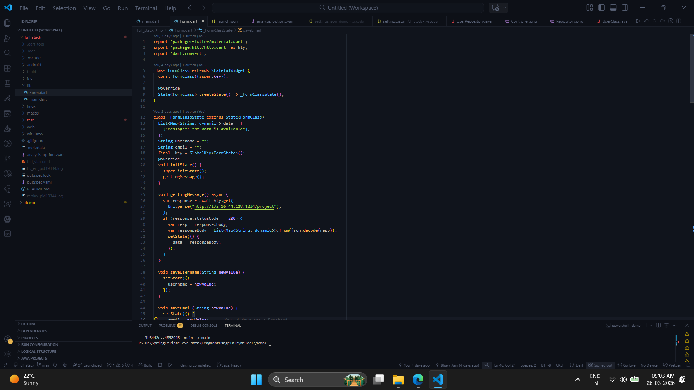
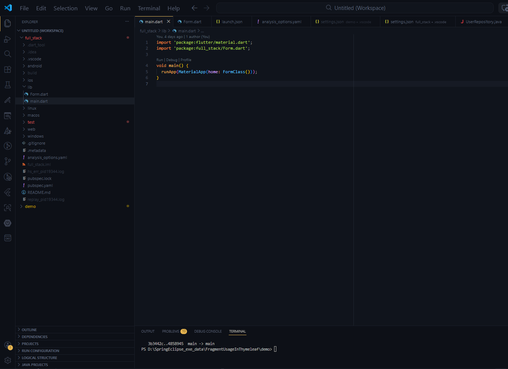
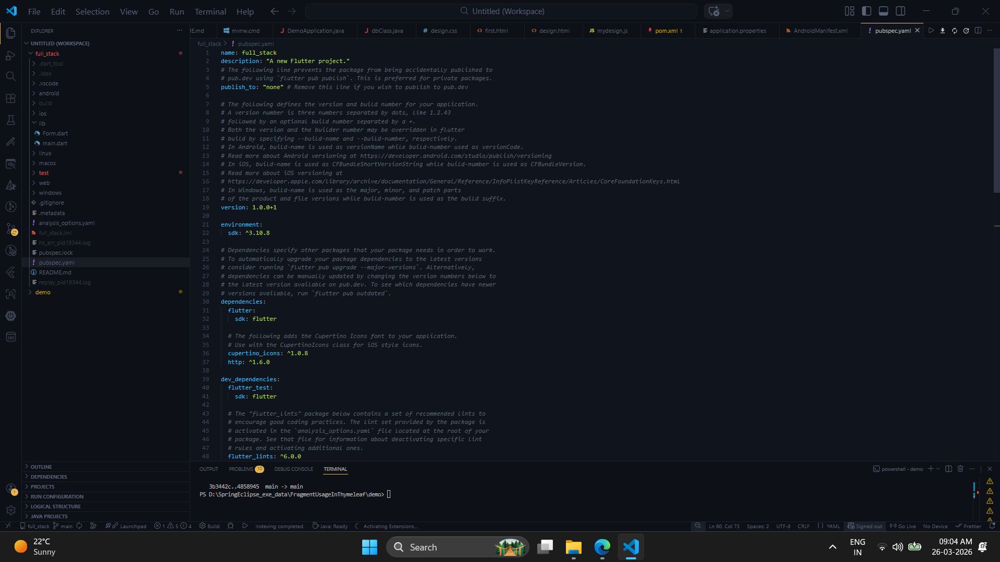

# 🚀 Full Stack Flutter App

This is a Flutter application that demonstrates **form validation**, **REST API integration**, and **dynamic data fetching** using HTTP requests.

---

## 📌 Features

- ✅ Form Validation (Username & Email)
- ✅ REST API Integration (GET & POST)
- ✅ Dynamic Data Rendering using ListView
- ✅ State Management using `setState`
- ✅ Backend Connectivity (Spring Boot / Node.js)

---

## 🛠️ Tech Stack

- **Frontend:** Flutter (Dart)
- **Backend:** REST API (Spring Boot / Node.js)
- **Networking:** http package
- **UI:** Material Design

---

## 📸 Screenshots

| Form Request | Main File | Pubspec |
|-------------|----------|---------|
|  |  |  |

---

## ⚙️ How It Works

- On app start (`initState`), a GET request is sent to `/project` to fetch user data.
- The fetched data is displayed dynamically using `ListView.builder`.
- The form validates:
  - Username must be at least 2 characters
  - Email must contain `@gmail.com`
- On submission, a POST request is sent to `/post` with user data.
- After successful creation (status 201), data is fetched again from `/project` to update UI.

---

## 🔌 API Endpoints

| Method | Endpoint  | Description        |
|--------|----------|--------------------|
| GET    | /project | Fetch all users    |
| POST   | /post    | Create new user    |

---

## 📂 Project Structure

---

## ▶️ Run Locally

1. Clone the repository:
```bash
git clone https://github.com/jain-2706/FlutterFrontEndFullStack.git
cd full_stack
flutter pub get
flutter run


## ⚠️ Backend Note

This app uses a locally running backend server.

- The backend (Spring Boot) must be running manually.
- API is hosted on a local IP address (e.g., http://172.16.44.128:1234).
- Both the mobile device/emulator and backend must be on the same WiFi network.

❗ This project will not work over the internet unless the backend is deployed.
